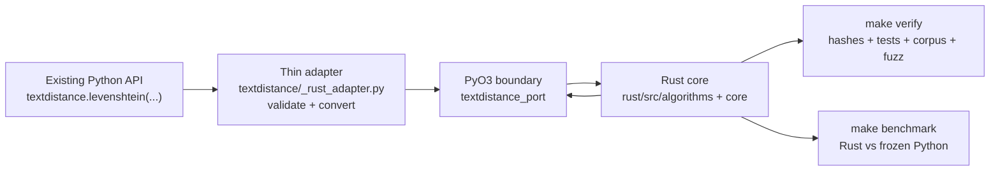

# TextDistance


[](https://travis-ci.org/life4/textdistance) [](https://pypi.python.org/pypi/textdistance) [](https://pypi.python.org/pypi/textdistance) [](LICENSE)

**TextDistance** — a Python library for comparing two or more sequences with
many distance and similarity algorithms.

## Hackathon submission: TextDistance Rust Port

This submission keeps the familiar TextDistance Python API while moving the
supported algorithm computation into a standalone Rust core. Python calls a
thin PyO3 adapter, the adapter converts inputs and options, Rust performs the
calculation, and the result is converted back to the original Python-shaped
output.

The integrated submission build is on the [`teja` branch](https://github.com/Simhateja17/raptors_hackathon/tree/teja).

### What we built

- A Rust implementation covering edit, token, sequence, compression, phonetic,
  alignment, and simple algorithm families.
- A thin Python/Rust boundary in
  [`python_adapter/src/lib.rs`](python_adapter/src/lib.rs), wired into the
  Rust crate through [`rust/src/lib.rs`](rust/src/lib.rs).
- Python compatibility wrappers that preserve the existing public API.
- Explicit input conversion and error handling for strings, bytes, integer and
  boolean sequences, q-grams, sequence outputs, and matrix options.
- No silent Python fallback: if the compiled extension is unavailable, the
  package reports a setup error instead of running the old implementation.

### Architecture at a glance



For a presentation-ready version of this diagram, open
[`docs/textdistance-demo.excalidraw`](docs/textdistance-demo.excalidraw).

### Five-minute judge walkthrough

Run these commands from the repository root:

```bash
make demo
make verify
make benchmark
```

The demo shows Levenshtein, Jaro-Winkler, q-value sequence reconstruction, and
floating-point Matrix options. The verification command checks the unchanged
original-test hashes, native Rust tests, the 114-case differential corpus, the
seeded fuzz smoke test, and the 400-case non-external original suite. The
benchmark command records reproducible Rust/native and frozen-Python results
in [`bench/report.md`](bench/report.md). The full narration path is in
[`docs/DEMO.md`](docs/DEMO.md).

### Evidence judges can inspect

| Claim | Evidence |
| --- | --- |
| Rust owns the supported computation | [`rust/src/`](rust/src/), [`python_adapter/src/lib.rs`](python_adapter/src/lib.rs), and [`textdistance/_rust_adapter.py`](textdistance/_rust_adapter.py) |
| Original tests were preserved | [`tests/original/`](tests/original/) and [`proof/original-tests.sha256`](proof/original-tests.sha256) |
| Differential behavior is covered | [`proof/verify_corpus.py`](proof/verify_corpus.py) and [`proof/corpus.md`](proof/corpus.md) — 114/114 cases pass |
| Randomized safety was checked | [`proof/fuzz-smoke.md`](proof/fuzz-smoke.md) — zero recorded panics |
| Performance is reproducible | [`bench/report.md`](bench/report.md) and [`bench/results/`](bench/results/) |
| Compatibility decisions are explicit | [`docs/DECISIONS.md`](docs/DECISIONS.md) |

### Team contribution

Poojitha, Manasa, and Suri implemented algorithm packets and their native
tests. Simha Teja integrated the teammate branches, completed the Lane 4 FFI
and verification work, preserved the original test snapshot, ran the proof
gates, and published the integrated `teja` branch.

### Runtime and verification note

The original upstream documentation remains below for API reference. For this
hackathon path, use the Rust-backed commands above. The required `make verify`
path passes. The optional `make test-external` comparison currently exposes
three documented RapidFuzz large-integer sequence coercion differences; the
Rust port follows the frozen implementation rather than imitating that
provider-specific behavior.

The Makefile prefers an available project interpreter under `.venvs/` and pins
PyO3 to that same interpreter through `PYO3_PYTHON=$(PYTHON)`. You can choose
another one explicitly, for example `make PYTHON=/path/to/python verify`. If
Python was upgraded, run `cargo clean` once and then rerun `make build`.

## Original TextDistance API reference

The sections below are retained from the upstream library documentation. They
describe the public algorithms and usage surface that this Rust port preserves.

Features:

- 30+ algorithms
- Familiar Python API
- Simple usage
- More than two sequences comparing
- Some algorithms have more than one implementation in one class.
- Optional numpy usage for maximum speed.

## Algorithms

### Edit based

| Algorithm                                                                                 | Class                | Functions              |
|-------------------------------------------------------------------------------------------|----------------------|------------------------|
| [Hamming](https://en.wikipedia.org/wiki/Hamming_distance)                                 | `Hamming`            | `hamming`              |
| [MLIPNS](http://www.sial.iias.spb.su/files/386-386-1-PB.pdf)                              | `MLIPNS`             | `mlipns`               |
| [Levenshtein](https://en.wikipedia.org/wiki/Levenshtein_distance)                         | `Levenshtein`        | `levenshtein`          |
| [Damerau-Levenshtein](https://en.wikipedia.org/wiki/Damerau%E2%80%93Levenshtein_distance) | `DamerauLevenshtein` | `damerau_levenshtein`  |
| [Jaro-Winkler](https://en.wikipedia.org/wiki/Jaro%E2%80%93Winkler_distance)               | `JaroWinkler`        | `jaro_winkler`, `jaro` |
| [Strcmp95](http://cpansearch.perl.org/src/SCW/Text-JaroWinkler-0.1/strcmp95.c)            | `StrCmp95`           | `strcmp95`             |
| [Needleman-Wunsch](https://en.wikipedia.org/wiki/Needleman%E2%80%93Wunsch_algorithm)      | `NeedlemanWunsch`    | `needleman_wunsch`     |
| [Gotoh](http://bioinfo.ict.ac.cn/~dbu/AlgorithmCourses/Lectures/LOA/Lec6-Sequence-Alignment-Affine-Gaps-Gotoh1982.pdf) | `Gotoh`              | `gotoh`                |
| [Smith-Waterman](https://en.wikipedia.org/wiki/Smith%E2%80%93Waterman_algorithm)          | `SmithWaterman`      | `smith_waterman`       |

### Token based

| Algorithm                                                                                 | Class                | Functions     |
|-------------------------------------------------------------------------------------------|----------------------|---------------|
| [Jaccard index](https://en.wikipedia.org/wiki/Jaccard_index)                              | `Jaccard`            | `jaccard`     |
| [Sørensen–Dice coefficient](https://en.wikipedia.org/wiki/S%C3%B8rensen%E2%80%93Dice_coefficient) | `Sorensen`   | `sorensen`, `sorensen_dice`, `dice` |
| [Tversky index](https://en.wikipedia.org/wiki/Tversky_index)                              | `Tversky`            | `tversky`    |
| [Overlap coefficient](https://en.wikipedia.org/wiki/Overlap_coefficient)                  | `Overlap`            | `overlap`    |
| [Tanimoto distance](https://en.wikipedia.org/wiki/Jaccard_index#Tanimoto_similarity_and_distance) | `Tanimoto`   | `tanimoto`   |
| [Cosine similarity](https://en.wikipedia.org/wiki/Cosine_similarity)                      | `Cosine`             | `cosine`     |
| [Monge-Elkan](https://www.academia.edu/200314/Generalized_Monge-Elkan_Method_for_Approximate_Text_String_Comparison) | `MongeElkan` | `monge_elkan` |
| [Bag distance](https://github.com/Yomguithereal/talisman/blob/master/src/metrics/bag.js) | `Bag`        | `bag`        |

### Sequence based

| Algorithm | Class | Functions |
|-----------|-------|-----------|
| [longest common subsequence similarity](https://en.wikipedia.org/wiki/Longest_common_subsequence_problem)          | `LCSSeq` | `lcsseq` |
| [longest common substring similarity](https://docs.python.org/2/library/difflib.html#difflib.SequenceMatcher)      | `LCSStr` | `lcsstr` |
| [Ratcliff-Obershelp similarity](https://en.wikipedia.org/wiki/Gestalt_Pattern_Matching) | `RatcliffObershelp` | `ratcliff_obershelp` |

### Compression based

[Normalized compression distance](https://en.wikipedia.org/wiki/Normalized_compression_distance#Normalized_compression_distance) with different compression algorithms.

Classic compression algorithms:

| Algorithm                                                                  | Class       | Function     |
|----------------------------------------------------------------------------|-------------|--------------|
| [Arithmetic coding](https://en.wikipedia.org/wiki/Arithmetic_coding)       | `ArithNCD`  | `arith_ncd`  |
| [RLE](https://en.wikipedia.org/wiki/Run-length_encoding)                   | `RLENCD`    | `rle_ncd`    |
| [BWT RLE](https://en.wikipedia.org/wiki/Burrows%E2%80%93Wheeler_transform) | `BWTRLENCD` | `bwtrle_ncd` |

Normal compression algorithms:

| Algorithm                                                                  | Class        | Function      |
|----------------------------------------------------------------------------|--------------|---------------|
| Square Root                                                                | `SqrtNCD`    | `sqrt_ncd`    |
| [Entropy](https://en.wikipedia.org/wiki/Entropy_(information_theory))      | `EntropyNCD` | `entropy_ncd` |

Work in progress algorithms that compare two strings as array of bits:

| Algorithm                                  | Class     | Function   |
|--------------------------------------------|-----------|------------|
| [BZ2](https://en.wikipedia.org/wiki/Bzip2) | `BZ2NCD`  | `bz2_ncd`  |
| [LZMA](https://en.wikipedia.org/wiki/LZMA) | `LZMANCD` | `lzma_ncd` |
| [ZLib](https://en.wikipedia.org/wiki/Zlib) | `ZLIBNCD` | `zlib_ncd` |

See [blog post](https://articles.life4web.ru/other/ncd/) for more details about NCD.

### Phonetic

| Algorithm                                                                    | Class    | Functions |
|------------------------------------------------------------------------------|----------|-----------|
| [MRA](https://en.wikipedia.org/wiki/Match_rating_approach)                   | `MRA`    | `mra`     |
| [Editex](https://anhaidgroup.github.io/py_stringmatching/v0.3.x/Editex.html) | `Editex` | `editex`  |

### Simple

| Algorithm           | Class      | Functions  |
|---------------------|------------|------------|
| Prefix similarity   | `Prefix`   | `prefix`   |
| Postfix similarity  | `Postfix`  | `postfix`  |
| Length distance     | `Length`   | `length`   |
| Identity similarity | `Identity` | `identity` |
| Matrix similarity   | `Matrix`   | `matrix`   |

## Installation

### Stable

Only pure python implementation:

```bash
pip install textdistance
```

With extra libraries for maximum speed:

```bash
pip install "textdistance[extras]"
```

With all libraries (required for [benchmarking](#benchmarks) and [testing](#running-tests)):

```bash
pip install "textdistance[benchmark]"
```

With algorithm specific extras:

```bash
pip install "textdistance[Hamming]"
```

Algorithms with available extras: `DamerauLevenshtein`, `Hamming`, `Jaro`, `JaroWinkler`, `Levenshtein`.

### Dev

Via pip:

```bash
pip install -e git+https://github.com/life4/textdistance.git#egg=textdistance
```

Or clone repo and install with some extras:

```bash
git clone https://github.com/life4/textdistance.git
pip install -e ".[benchmark]"
```

## Usage

All algorithms have 2 interfaces:

1. Class with algorithm-specific params for customizing.
1. Class instance with default params for quick and simple usage.

All algorithms have some common methods:

1. `.distance(*sequences)` -- calculate distance between sequences.
1. `.similarity(*sequences)` -- calculate similarity for sequences.
1. `.maximum(*sequences)` -- maximum possible value for distance and similarity. For any sequence: `distance + similarity == maximum`.
1. `.normalized_distance(*sequences)` -- normalized distance between sequences. The return value is a float between 0 and 1, where 0 means equal, and 1 totally different.
1. `.normalized_similarity(*sequences)` -- normalized similarity for sequences. The return value is a float between 0 and 1, where 0 means totally different, and 1 equal.

Most common init arguments:

1. `qval` -- q-value for split sequences into q-grams. Possible values:
    - 1 (default) -- compare sequences by chars.
    - 2 or more -- transform sequences to q-grams.
    - None -- split sequences by words.
1. `as_set` -- for token-based algorithms:
    - True -- `t` and `ttt` is equal.
    - False (default) -- `t` and `ttt` is different.

## Examples

For example, [Hamming distance](https://en.wikipedia.org/wiki/Hamming_distance):

```python
import textdistance

textdistance.hamming('test', 'text')
# 1

textdistance.hamming.distance('test', 'text')
# 1

textdistance.hamming.similarity('test', 'text')
# 3

textdistance.hamming.normalized_distance('test', 'text')
# 0.25

textdistance.hamming.normalized_similarity('test', 'text')
# 0.75

textdistance.Hamming(qval=2).distance('test', 'text')
# 2

```

Any other algorithms have same interface.

## Articles

A few articles with examples how to use textdistance in the real world:

- [Guide to Fuzzy Matching with Python](http://theautomatic.net/2019/11/13/guide-to-fuzzy-matching-with-python/)
- [String similarity — the basic know your algorithms guide!](https://itnext.io/string-similarity-the-basic-know-your-algorithms-guide-3de3d7346227)
- [Normalized compression distance](https://articles.life4web.ru/other/ncd/)

## Extra libraries

For main algorithms textdistance try to call known external libraries (fastest first) if available (installed in your system) and possible (this implementation can compare this type of sequences). [Install](#installation) textdistance with extras for this feature.

You can disable this by passing `external=False` argument on init:

```python3
import textdistance
hamming = textdistance.Hamming(external=False)
hamming('text', 'testit')
# 3
```

Supported libraries:

1. [jellyfish](https://github.com/jamesturk/jellyfish)
1. [py_stringmatching](https://github.com/anhaidgroup/py_stringmatching)
1. [pylev](https://github.com/toastdriven/pylev)
1. [Levenshtein](https://github.com/maxbachmann/Levenshtein)
1. [pyxDamerauLevenshtein](https://github.com/gfairchild/pyxDamerauLevenshtein)

Algorithms:

1. DamerauLevenshtein
1. Hamming
1. Jaro
1. JaroWinkler
1. Levenshtein

## Benchmarks

Without extras installation:

| algorithm          | library               |    time |
|--------------------|-----------------------|---------|
| DamerauLevenshtein | rapidfuzz             | 0.00312 |
| DamerauLevenshtein | jellyfish             | 0.00591 |
| DamerauLevenshtein | pyxdameraulevenshtein | 0.03335 |
| DamerauLevenshtein | **textdistance**      | 0.83524 |
| Hamming            | Levenshtein           | 0.00038 |
| Hamming            | rapidfuzz             | 0.00044 |
| Hamming            | jellyfish             | 0.00091 |
| Hamming            | **textdistance**      | 0.03531 |
| Jaro               | rapidfuzz             | 0.00092 |
| Jaro               | jellyfish             | 0.00191 |
| Jaro               | **textdistance**      | 0.07365 |
| JaroWinkler        | rapidfuzz             | 0.00094 |
| JaroWinkler        | jellyfish             | 0.00195 |
| JaroWinkler        | **textdistance**      | 0.07501 |
| Levenshtein        | rapidfuzz             | 0.00099 |
| Levenshtein        | Levenshtein           | 0.00122 |
| Levenshtein        | jellyfish             | 0.00254 |
| Levenshtein        | pylev                 | 0.15688 |
| Levenshtein        | **textdistance**      | 0.53902 |

Total: 24 libs.

Yeah, so slow. Use TextDistance on production only with extras.

Textdistance use benchmark's results for algorithm's optimization and try to call fastest external lib first (if possible).

You can run benchmark manually on your system:

```bash
pip install textdistance[benchmark]
python3 -m textdistance.benchmark
```

TextDistance show benchmarks results table for your system and save libraries priorities into `libraries.json` file in TextDistance's folder. This file will be used by textdistance for calling fastest algorithm implementation. Default [libraries.json](textdistance/libraries.json) already included in package.

## Running tests

All you need is [task](https://taskfile.dev/). See [Taskfile.yml](./Taskfile.yml) for the list of available commands. For example, to run tests including third-party libraries usage, execute `task pytest-external:run`.

## Contributing

PRs are welcome!

- Found a bug? Fix it!
- Want to add more algorithms? Sure! Just make it with the same interface as other algorithms in the lib and add some tests.
- Can make something faster? Great! Just avoid external dependencies and remember that everything should work not only with strings.
- Something else that do you think is good? Do it! Just make sure that CI passes and everything from the README is still applicable (interface, features, and so on).
- Have no time to code? Tell your friends and subscribers about `textdistance`. More users, more contributions, more amazing features.

Thank you :heart:
